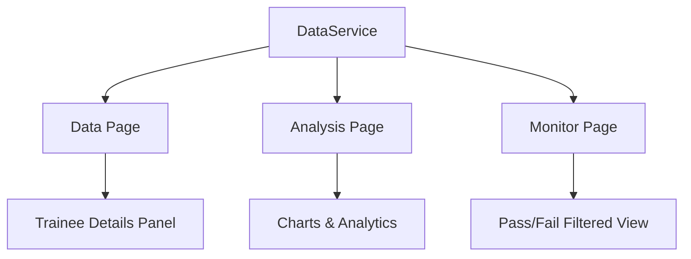
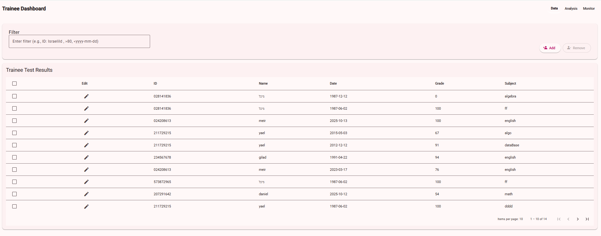
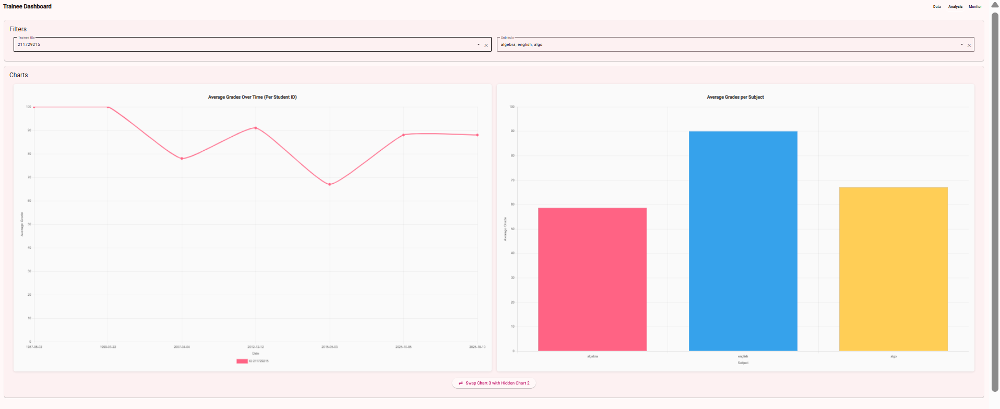
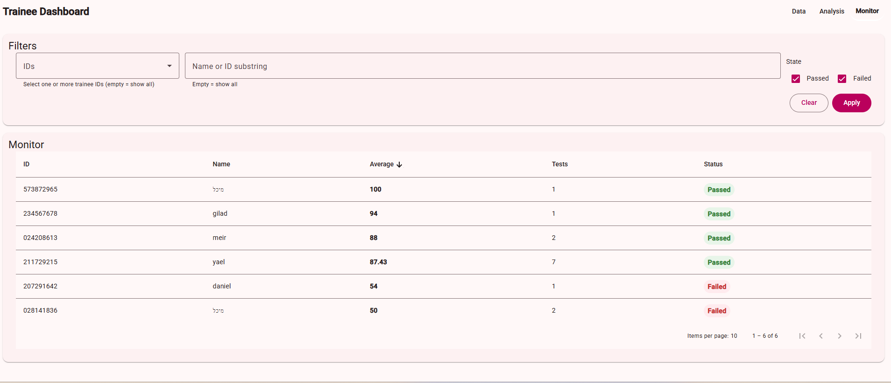

# 🧩 Biks Trainee Dashboard

A **Single Page Application (SPA)** developed for **BIKS Intelligence Solutions** as part of a **Senior Web Developer assignment**.  
The project manages and visualizes trainee test results, enabling filtering, analysis, and monitoring of performance through an intuitive and responsive web interface.

This app was built using **Angular 20**, **Angular Material Design**, and **TypeScript**, following best practices in modular structure, state management, and component-based architecture.

---

## 📘 Table of Contents

- [Overview](#-overview)
- [Features](#-features)
- [Project Structure](#-project-structure)
- [Technical Stack](#-technical-stack)
- [Pages & Functionality](#-pages--functionality)
- [Architecture Overview](#-architecture-overview)
- [Installation](#️-installation)
- [Running the Project](#-running-the-project)
- [Build Instructions](#️-build-instructions)
- [Testing](#-testing)
- [Screenshots](#️-screenshots)
- [Live Demo](#-live-demo)
- [Future Improvements](#-future-improvements)
- [Author](#-author)
- [License](#-license)

---

## 🧭 Overview

The **Biks Trainee Dashboard** is designed to simulate a real-world trainee management system, displaying test results and enabling both data management and analytical insights.  
It was developed according to the **Senior Web Developer Task** requirements, including state preservation, dynamic filters, and multi-page functionality.

> **Goal:** Build a fully functional, interactive SPA that allows users to view, filter, and analyze trainee data with saved state and responsive design.

---

## ✨ Features

✅ **Persistent state** - filters and selections are retained when navigating between pages  
✅ **Dynamic filtering** - search by ID, grade range, or date range  
✅ **Editable trainee details** - add/remove and save trainee data  
✅ **Interactive charts** - drag & drop between panels  
✅ **Performance monitoring** - color-coded pass/fail indicators  
✅ **Angular Material UI** - modern, responsive, and accessible  
✅ **Reactive services** - powered by RxJS and BehaviorSubject  

---

## 📂 Project Structure

The project follows Angular’s component-driven structure and modular architecture:

```bash

biks-trainee-dashboard/
├── docs/
│   └── screenshots/                       # Documentation images for README or reports
│       ├── AnalysisPage.png               # Screenshot of the Analysis page
│       ├── DataPage.png                   # Screenshot of the Data page
│       └── MonitorPage.png                # Screenshot of the Monitor page
│
├── public/
│   └── favicon.ico                        # Application icon
│
├── src/
│   ├── app/
│   │   ├── material/
│   │   │   └── material.module.ts         # Centralized Angular Material imports/exports
│   │   │
│   │   ├── models/
│   │   │   └── trainee.ts                 # TypeScript interface for Trainee objects
│   │   │
│   │   ├── pages/
│   │   │   ├── analysis/
│   │   │   │   ├── analysis.component.html # Template for Analysis page (charts & filters)
│   │   │   │   ├── analysis.component.scss # Styles for Analysis page
│   │   │   │   ├── analysis.component.spec.ts # Unit tests for Analysis component
│   │   │   │   └── analysis.component.ts   # Chart logic, filtering, and state management
│   │   │   │
│   │   │   ├── data/
│   │   │   │   ├── data.component.html     # Template for Data page (table, filters)
│   │   │   │   ├── data.component.scss     # Styles for Data page
│   │   │   │   ├── data.component.spec.ts  # Unit tests for Data component
│   │   │   │   ├── data.component.ts       # Logic for managing trainees & filters
│   │   │   │   ├── trainee-details-dialog.component.html # Dialog template for trainee details
│   │   │   │   └── trainee-details-dialog.component.ts   # Logic for trainee detail modal
│   │   │   │
│   │   │   └── monitor/
│   │   │       ├── monitor.component.html  # Template for Monitor page (pass/fail view)
│   │   │       ├── monitor.component.scss  # Styles for Monitor page
│   │   │       ├── monitor.component.spec.ts # Unit tests for Monitor component
│   │   │       └── monitor.component.ts    # Logic for trainee performance monitoring
│   │   │
│   │   ├── pages-module.ts                 # Module definition for all app pages
│   │   ├── pages-routing-module.ts         # Routing configuration for pages
│   │   │
│   │   ├── services/
│   │   │   ├── data.service.ts             # Data management service using RxJS BehaviorSubject
│   │   │   └── state.service.ts            # Service for persisting user selection state
│   │   │
│   │   ├── pipes/
│   │   │   └── unique-by-id.pipe.ts       # Pipe to filter unique items by ID
│   │   │
│   │   ├── validators/
│   │   │   └── israeli-id.directive.ts    # Directive to validate Israeli ID numbers
│   │   │
│   │   ├── shared/
│   │   │   ├── footer/
│   │   │   │   ├── footer.html            # Footer template
│   │   │   │   ├── footer.scss            # Footer styles
│   │   │   │   ├── footer.spec.ts         # Footer component tests
│   │   │   │   └── footer.ts              # Footer component logic
│   │   │   │
│   │   │   └── header/
│   │   │       ├── header.html            # Header template
│   │   │       ├── header.scss            # Header styles
│   │   │       ├── header.spec.ts         # Header component tests
│   │   │       └── header.ts              # Header component logic
│   │   │
│   │   ├── app.component.ts               # Root Angular component; bootstraps the app
│   │   ├── app.component.html             # Main app layout (router outlet + header/footer)
│   │   ├── app.component.scss             # Global layout & theme styles
│   │   ├── app.config.ts                  # Global configuration & app-wide providers
│   │   ├── app.routes.ts                  # Application-wide route definitions
│   │   ├── app.spec.ts                    # Unit tests for main app component
│   │
│   ├── index.html                         # Main HTML file loaded at runtime
│   ├── main.ts                            # Application entry point (bootstraps Angular app)
│   ├── styles.scss                        # Global SCSS styles shared across the app
│   └── test.ts                            # Entry point for running Karma + Jasmine unit tests
│
├── .editorconfig                           # Coding style configuration
├── .gitignore                              # Files and folders to ignore in Git
├── .hintrc                                 # Linting and HTML hinting configuration
├── angular.json                            # Angular workspace and build configuration
├── karma.conf.js                           # Karma test runner configuration (browsers, reporters, etc.)
├── package-lock.json                       # Locked dependency versions
├── package.json                            # Project dependencies, scripts, and metadata
├── README.md                               # Project documentation file
├── tsconfig.app.json                       # TypeScript configuration for app source files
├── tsconfig.json                           # Base TypeScript configuration
└── tsconfig.spec.json                      # TypeScript configuration for testing
```

---

## 🧰 Technical Stack

- **Frontend Framework:** Angular 20 (CLI 20.3.3)
- **Language:** TypeScript
- **UI Library:** Angular Material Design
- **Reactive Extensions:** RxJS
- **Charts:** (if applicable) ngx-charts / Chart.js
- **Version Control:** Git + GitHub
- **Testing Framework:** Karma & Jasmine

---

## 📄 Pages & Functionality

### 1. **Data Page**

- Displays all trainee test results in a paginated Material table.
- Filters support:
  - `ID:` - filter by trainee ID
  - `>`, `<` - filter grades or dates in a range
- Selecting a row opens a **Details Panel**:
  - View and edit trainee details
  - Add a new trainee
  - Remove an existing trainee
- State is preserved when returning to the page.

### 2. **Analysis Page**

- Multi-select dropdowns for:
  - Trainee IDs
  - Subjects
- Two interactive charts displayed at once:
  - Chart 1 & Chart 2 (data per trainee)
  - Chart 3 (data per subject)
- Drag-and-drop to swap chart positions.
- Bottom “Hidden Chart” button lets you replace displayed charts dynamically.

### 3. **Monitor Page**

- Displays whether each trainee’s average score is above 65:
  - ✅ **Green:** Passed
  - ❌ **Red:** Failed
- Filters by:
  - IDs (multi-select)
  - Names (free text)
  - State (checkboxes for Passed/Failed)
- Dynamically updates results in real-time.

---

## 🧱 Architecture Overview



---

## ⚙️ Installation

To clone and set up the project locally:

```bash
# Clone the repository
git clone https://github.com/Yael-Karat/biks-trainee-dashboard.git

# Navigate to the project directory
cd biks-trainee-dashboard

# Install dependencies
npm install
```

---

## 🚀 Running the Project

To start the local development server:

```bash
ng serve
```

Once compiled successfully, open your browser and go to:

👉 [http://localhost:4200/](http://localhost:4200/)

The app supports hot reload - any code changes automatically refresh the UI.

---

## 🏗️ Build Instructions

To create a production build:

```bash
ng build --configuration production
```

The compiled output will be stored in the `/dist` directory.
You can deploy this folder to any static hosting service (e.g., GitHub Pages, Netlify, Firebase).

---

## 🧪 Testing

Run unit tests using:

```bash
ng test
```

Tests are executed via [Karma](https://karma-runner.github.io) and [Jasmine](https://jasmine.github.io).

---

## 🖼️ Screenshots

| Page              | Description                                         | Preview                                           |
| ----------------- | --------------------------------------------------- | ------------------------------------------------- |
| **Data Page**     | Trainee results with filtering and editable details |          |
| **Analysis Page** | Interactive charts for trainee analysis             |  |
| **Monitor Page**  | Pass/fail overview with filters                     |    |

---

## 🌐 Live Demo

A hosted version of the project is available at:
🔗 **[Live Demo – Biks Trainee Dashboard](https://yael-karat.github.io/biks-trainee-dashboard/)**

---

## 🚧 Future Improvements

- Add backend integration (REST API / Firebase)
- Include export options (CSV/PDF)
- More advanced analytics and charts
- Role-based authentication system
- Dark mode toggle

---

## 👩‍💻 Author

**Yael Karat**  
Software Developer | Full Stack Developer | Web Development | Test Automation  
📧 [yaelkarat01@gmail.com](mailto:yaelkarat01@gmail.com)  
🌐 [LinkedIn Profile](https://www.linkedin.com/in/yael-karat)  
💻 [GitHub Profile](https://github.com/Yael-Karat)  

---

## 📝 License

This project is licensed under the **MIT License** - feel free to use, modify, and distribute it for educational or professional purposes.

---

> © 2025 BIKS Intelligence Solutions - Senior Web Developer Assignment Submission
> Developed with ❤️ by Yael Karat using Angular 20.
